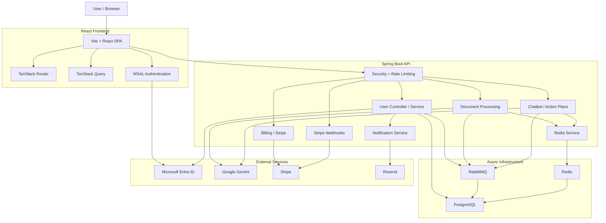

# Admina

Admina is a full-stack document automation and account management platform.
It combines a Spring Boot backend with a React frontend to handle:

- Microsoft Entra authentication
- document ingestion and AI-assisted processing
- task tracking and dashboard reporting
- billing and subscription management with Stripe
- async work through RabbitMQ
- caching, rate limiting, and job state tracking with Redis

## Repository Layout

- `java-springboot-backend/`: Spring Boot API, background jobs, integrations, and persistence
- `react-frontend/`: React single-page application for the public site and authenticated dashboard

## Architecture



## What The App Does

- The frontend signs users in with Microsoft Entra and routes authenticated users to the dashboard.
- The backend authenticates or registers the user, returns the user snapshot, and manages access rules.
- Document uploads are processed asynchronously, with status tracking and AI-backed extraction/translation.
- The dashboard summarizes recent documents, pending tasks, and deadlines.
- Billing flows use Stripe checkout and webhook reconciliation.

## Technology Stack

### Backend

- Spring Boot 3.5
- Spring Security
- Spring Data JPA
- Spring AMQP / RabbitMQ
- Spring Data Redis
- Flyway
- PostgreSQL
- Lombok
- Springdoc OpenAPI
- Stripe Java SDK
- Google GenAI SDK
- Datasource Proxy

### Frontend

- React 19
- Vite
- TypeScript
- TanStack Router
- TanStack Query
- Axios
- MSAL React / MSAL Browser
- React Hook Form
- Zod
- Zustand
- Radix UI
- Lucide Icons
- Tailwind CSS
- Motion
- Sentry

## Local Development

### Backend

```bash
cd java-springboot-backend
./gradlew bootRun
```

### Frontend

```bash
cd react-frontend
pnpm install
pnpm dev
```

## One Command Docker Setup

From the repository root:

```bash
docker compose up --build
```

This starts:

- frontend on `http://localhost:3000`
- backend API on `http://localhost:8080`
- PostgreSQL on `localhost:5432`
- RabbitMQ on `localhost:5672` and management UI on `http://localhost:15672`
- Redis on `localhost:6379`

## Notes

- The frontend image build reads the Vite environment variables from `react-frontend/.env`.
- Docker Compose loads the backend environment variables from `java-springboot-backend/.env` and applies runtime overrides for the container network.
- The dashboard currently relies on the backend `/api/v1/users/authenticate` response shape.
