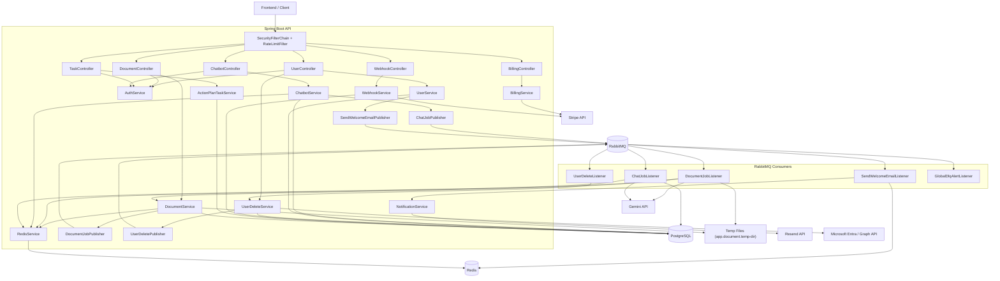

# Admina API (Java)

Spring Boot API for user auth, document ingestion, and async processing with RabbitMQ + Redis. PostgreSQL is used for persisted data. JWT validation uses Microsoft Entra ID.

## Architecture



### Runtime Flow (High Level)

1. Incoming requests pass through rate limiting and JWT validation (Entra issuer/audience).
2. Controllers call domain services for users, documents/tasks/chat, billing, and webhooks.
3. Document ingestion is asynchronous: upload -> Redis capacity/lock checks -> temp file -> Rabbit job -> Gemini translate/summarize -> DB persist -> status updates in Redis.
4. Chat is created as a RabbitMQ job, stored in Redis for polling, and completed by a RabbitMQ listener.
5. User lifecycle events are asynchronous: welcome email and Entra disable-on-delete are published after DB commit and handled by listeners.
6. Stripe checkout/portal is synchronous; Stripe webhooks are verified, idempotent, and update user plan/limits.
7. Rabbit listeners use retries or fail-fast policies and route failed messages to a global DLQ listener.

## Services

- `auth`: JWT claim extraction and validation
- `user`: user lookup/registration and initial document/task snapshot
- `document`: upload validation, enqueue, status tracking, persistence
- `tasks`: CRUD for document action-plan tasks
- `chatbot`: chat job creation, RabbitMQ processing, polling, and persistence
- `billing`: Stripe checkout and customer portal
- `webhook`: Stripe webhook verification and plan synchronization
- `user-delete`: delete local user and async Entra disable
- `notification`: welcome email sending (Resend)
- `redis`: rate limiting, status cache, idempotency, and locks
- `ai`: Gemini integration

## Prerequisites

- Java 21
- Docker + Docker Compose
- PostgreSQL, RabbitMQ, Redis (provided via compose)

## Configuration

`.env` (not committed) must include at least:

```
DATABASE_USER=admina
DATABASE_PASSWORD=admina_password
AZURE_ISSUER_URI=https://<TENANT_ID>.ciamlogin.com/<TENANT_ID>/v2.0
AZURE_API_AUDIENCE=<YOUR_API_CLIENT_ID_OR_APP_ID_URI>
RABBITMQ_USER=admina
RABBITMQ_PASSWORD=admina_password
REDIS_PORT=6379
```

Optional:
```
RESEND_API_KEY=XXXXXXXXXXXXX
RESEND_FROM_EMAIL=XXXXXXXXXXX
```

## Local Run (Docker)

Build the jar, then run the stack:

```
./gradlew clean build
docker compose up -d --build
```

API runs on `http://localhost:8080`.

Swagger UI:
```
http://localhost:8080/swagger-ui.html
```

OpenAPI JSON:
```
http://localhost:8080/v3/api-docs
```

Logs:
```
docker compose logs -f api
```

## Endpoints

### Auth

```
POST /api/users/authenticate
Authorization: Bearer <ACCESS_TOKEN>
```

### Documents

Create job:
```
POST /api/v1/documents/createDocument
Authorization: Bearer <ACCESS_TOKEN>
Content-Type: multipart/form-data
file=<PDF|PNG|JPG> (max 6MB)
docLanguage=<2-5 letters>
targetLanguage=<2-5 letters>
```

Response:
```
{ "docId": "<uuid>", "status": "PENDING" }
```

Status:
```
GET /api/v1/documents/status/{docId}
```

### Chat

Create job:
```
POST /api/v1/documents/{docId}/chat
Authorization: Bearer <ACCESS_TOKEN>
Content-Type: application/json
{ "prompt": "..." }
```

Response:
```
{ "chatbotPollingId": "<uuid>", "docId": "<uuid>", "status": "PENDING" }
```

Poll status:
```
GET /api/v1/documents/{docId}/chat/status/{chatbotPollingId}
```

## Document Processing Behavior

- One in-flight document per user (Redis lock).
- Document pipeline capacity is capped at 40 total in-flight jobs per instance via Redis admission control.
- Job status stored in Redis with a 15-minute TTL.
- Worker drops jobs if status expired or cancelled.
- Gemini translation and summarization are executed in the document worker before persistence.
- Document status transitions include `PENDING`, `QUEUE`, `TRANSLATE`, `SUMMARIZE`, `SAVING`, `COMPLETED`, `ERROR`.
- Temp files are stored at `/app/temp` (mounted from host).
- Rabbit listener execution uses virtual threads.
- Document listeners run with concurrency `5` and max concurrency `20`.
- Notification listeners run with concurrency `2` and max concurrency `5`.

## Rate Limiting

API-level rate limiting is enforced via Redis (global per user/IP).

Defaults (configurable):
- Authenticated: 60 req/min per user
- Unauthenticated: 30 req/min per IP

Response headers:
- `X-RateLimit-Limit`
- `X-RateLimit-Remaining`
- `X-RateLimit-Reset` (seconds)

## Testing the API (UI)

Standard Java approach: **Swagger/OpenAPI UI** via `springdoc-openapi`. This project does not include it yet.

Recommended options:
1. Add Swagger UI (standard in Spring Boot):
   - Add `org.springdoc:springdoc-openapi-starter-webmvc-ui`
   - Then use `http://localhost:8080/swagger-ui.html`
2. Use Postman/Insomnia for manual testing.

If you want Swagger UI wired now, say so.

## Notes

- RabbitMQ management UI: `http://localhost:15672` (credentials from `.env`)
- Redis is used for job status + per-user locks.
- JWT validation uses Entra ID issuer/audience configuration.
